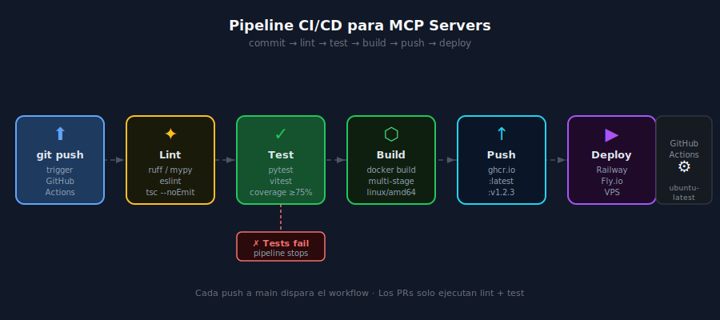

# CI para MCP: lint → test → build → push imagen

## 🎯 Objetivos

- Diseñar un pipeline CI/CD completo para un MCP Server en Python y TypeScript
- Automatizar la construcción y publicación de imágenes Docker
- Implementar estrategias de caché para pipelines rápidos
- Configurar condiciones para que solo se haga push en ramas específicas

---



---

## 1. Pipeline Completo para Python MCP Server

El pipeline de CI para un MCP Server Python sigue este orden:

```
git push → checkout → setup Python + uv → lint → test → build Docker → push GHCR
```

### Workflow completo: `.github/workflows/ci-python.yml`

```yaml
name: CI — Python MCP Server

on:
  push:
    branches: [main]
  pull_request:

permissions:
  contents: read
  packages: write           # Necesario para push a GHCR

jobs:
  # ─────────────────────────────────────────
  # JOB 1: Lint y análisis estático
  # ─────────────────────────────────────────
  lint:
    name: Lint & Type Check
    runs-on: ubuntu-latest
    steps:
      - uses: actions/checkout@v4

      - uses: actions/setup-python@v5
        with:
          python-version: "3.13"

      - name: Install uv
        run: pip install --no-cache-dir uv==0.6.6

      - name: Cache uv
        uses: actions/cache@v4
        with:
          path: ~/.cache/uv
          key: uv-${{ runner.os }}-${{ hashFiles('uv.lock') }}
          restore-keys: uv-${{ runner.os }}-

      - name: Install dependencies
        run: uv sync --frozen

      - name: Ruff lint
        run: uv run ruff check src/ tests/

      - name: Mypy type check
        run: uv run mypy src/

  # ─────────────────────────────────────────
  # JOB 2: Tests con coverage
  # ─────────────────────────────────────────
  test:
    name: Tests
    runs-on: ubuntu-latest
    needs: lint               # Solo si lint pasa
    steps:
      - uses: actions/checkout@v4

      - uses: actions/setup-python@v5
        with:
          python-version: "3.13"

      - name: Install uv
        run: pip install --no-cache-dir uv==0.6.6

      - name: Cache uv
        uses: actions/cache@v4
        with:
          path: ~/.cache/uv
          key: uv-${{ runner.os }}-${{ hashFiles('uv.lock') }}
          restore-keys: uv-${{ runner.os }}-

      - name: Install dependencies (with test group)
        run: uv sync --frozen --group test

      - name: Run tests with coverage
        run: uv run pytest --cov=src --cov-report=term-missing --cov-fail-under=75
        env:
          DB_PATH: ":memory:"       # Siempre SQLite in-memory en CI

  # ─────────────────────────────────────────
  # JOB 3: Build y push Docker (solo en main)
  # ─────────────────────────────────────────
  docker:
    name: Docker Build & Push
    runs-on: ubuntu-latest
    needs: test               # Solo si tests pasan
    if: github.event_name == 'push' && github.ref == 'refs/heads/main'
    steps:
      - uses: actions/checkout@v4

      - name: Set up Docker Buildx
        uses: docker/setup-buildx-action@v3

      - name: Login to GHCR
        uses: docker/login-action@v3
        with:
          registry: ghcr.io
          username: ${{ github.actor }}
          password: ${{ secrets.GITHUB_TOKEN }}

      - name: Extract metadata
        id: meta
        uses: docker/metadata-action@v5
        with:
          images: ghcr.io/${{ github.repository }}
          tags: |
            type=raw,value=latest
            type=sha,prefix=sha-

      - name: Build and push
        uses: docker/build-push-action@v6
        with:
          context: .
          file: Dockerfile.python
          push: true
          tags: ${{ steps.meta.outputs.tags }}
          labels: ${{ steps.meta.outputs.labels }}
          cache-from: type=gha        # GitHub Actions cache para capas Docker
          cache-to: type=gha,mode=max
```

---

## 2. Pipeline para TypeScript MCP Server

El pipeline TypeScript es similar, pero usa `pnpm` y `node:22`.

### Workflow: `.github/workflows/ci-typescript.yml`

```yaml
name: CI — TypeScript MCP Server

on:
  push:
    branches: [main]
  pull_request:

permissions:
  contents: read
  packages: write

jobs:
  lint:
    name: Lint & Type Check
    runs-on: ubuntu-latest
    defaults:
      run:
        working-directory: ts-server/  # Si el código TS está en subdirectorio
    steps:
      - uses: actions/checkout@v4

      - uses: actions/setup-node@v4
        with:
          node-version: "22"

      - name: Enable pnpm via corepack
        run: corepack enable && corepack prepare pnpm@10.7.0 --activate

      - name: Cache pnpm store
        uses: actions/cache@v4
        with:
          path: ~/.local/share/pnpm/store
          key: pnpm-${{ runner.os }}-${{ hashFiles('**/pnpm-lock.yaml') }}
          restore-keys: pnpm-${{ runner.os }}-

      - name: Install dependencies
        run: pnpm install --frozen-lockfile

      - name: ESLint
        run: pnpm lint

      - name: Type check
        run: pnpm exec tsc --noEmit

  test:
    name: Tests
    runs-on: ubuntu-latest
    needs: lint
    defaults:
      run:
        working-directory: ts-server/
    steps:
      - uses: actions/checkout@v4

      - uses: actions/setup-node@v4
        with:
          node-version: "22"

      - name: Enable pnpm via corepack
        run: corepack enable && corepack prepare pnpm@10.7.0 --activate

      - name: Cache pnpm store
        uses: actions/cache@v4
        with:
          path: ~/.local/share/pnpm/store
          key: pnpm-${{ runner.os }}-${{ hashFiles('**/pnpm-lock.yaml') }}
          restore-keys: pnpm-${{ runner.os }}-

      - name: Install dependencies
        run: pnpm install --frozen-lockfile

      - name: Run vitest with coverage
        run: pnpm test --coverage

  docker:
    name: Docker Build & Push (TS)
    runs-on: ubuntu-latest
    needs: test
    if: github.event_name == 'push' && github.ref == 'refs/heads/main'
    steps:
      - uses: actions/checkout@v4
      - uses: docker/setup-buildx-action@v3
      - uses: docker/login-action@v3
        with:
          registry: ghcr.io
          username: ${{ github.actor }}
          password: ${{ secrets.GITHUB_TOKEN }}
      - name: Extract metadata
        id: meta
        uses: docker/metadata-action@v5
        with:
          images: ghcr.io/${{ github.repository }}-ts
          tags: |
            type=raw,value=latest
            type=sha,prefix=sha-
      - uses: docker/build-push-action@v6
        with:
          context: ts-server/
          file: ts-server/Dockerfile.node
          push: true
          tags: ${{ steps.meta.outputs.tags }}
          cache-from: type=gha
          cache-to: type=gha,mode=max
```

---

## 3. Condiciones con `if:`

El campo `if:` permite ejecutar un job o step solo cuando se cumple una condición.

```yaml
# Solo hacer push de imagen si estamos en push a main (no en PRs)
if: github.event_name == 'push' && github.ref == 'refs/heads/main'

# Solo ejecutar en tags semver
if: startsWith(github.ref, 'refs/tags/v')

# Ejecutar siempre, incluso si el job anterior falló
if: always()

# Solo si el step anterior falló
if: failure()
```

---

## 4. Matrix Strategy

Para tests en múltiples versiones de Python o Node.js:

```yaml
jobs:
  test:
    strategy:
      matrix:
        python-version: ["3.12", "3.13"]
        os: [ubuntu-latest]
    runs-on: ${{ matrix.os }}
    steps:
      - uses: actions/setup-python@v5
        with:
          python-version: ${{ matrix.python-version }}
      - run: uv run pytest
```

---

## 5. Artifacts — Guardar reportes de cobertura

```yaml
- name: Run tests
  run: uv run pytest --cov=src --cov-report=xml --cov-report=html

- name: Upload coverage report
  uses: actions/upload-artifact@v4
  with:
    name: coverage-report
    path: htmlcov/
    retention-days: 7           # Se borra automáticamente a los 7 días
```

El reporte queda disponible en la UI de GitHub Actions para descarga.

---

## 6. Resumen de Tiempos Esperados

| Job | Python | TypeScript |
|-----|--------|------------|
| Lint (primera vez, sin caché) | ~1:30 min | ~1:20 min |
| Lint (con caché) | ~25 seg | ~20 seg |
| Tests | ~1:00 min | ~40 seg |
| Docker build + push | ~2:30 min | ~2:00 min |
| **Total primera vez** | **~5:00 min** | **~4:00 min** |
| **Total con caché** | **~2:30 min** | **~2:00 min** |

---

## 7. Errores Comunes

| Error | Causa | Solución |
|-------|-------|----------|
| `Error: denied: installation not allowed to Write organization package` | Falta `permissions: packages: write` | Agregar al job de docker |
| `uv: not found` | `uv` no instalado en el runner | Agregar step `pip install uv==0.6.6` |
| `Process completed with exit code 2` en ruff | Errores de linting pendientes | Corregir errores localmente con `uv run ruff check --fix .` |
| `cov-fail-under=75` falla | Cobertura por debajo del mínimo | Agregar más tests, o bajar el umbral temporalmente |
| Push a GHCR falla en forks | Forks no tienen acceso a secretos por defecto | Solo hacer push desde el repo original |

---

## ✅ Checklist de Verificación

- [ ] Workflow `ci-python.yml` con jobs: lint → test → docker
- [ ] Workflow `ci-typescript.yml` con jobs: lint → test → docker
- [ ] Condición `if:` en job docker para evitar push en PRs
- [ ] Caché de uv y pnpm configurado
- [ ] `coverage --fail-under=75` activo en tests
- [ ] Push a GHCR funciona con `GITHUB_TOKEN` (sin secretos adicionales)
- [ ] Pipeline pasa en verde en la rama main

---

## 📚 Recursos Adicionales

- [GitHub Actions: Using workflows](https://docs.github.com/en/actions/using-workflows)
- [docker/build-push-action](https://github.com/docker/build-push-action)
- [docker/metadata-action](https://github.com/docker/metadata-action)
- [actions/cache](https://github.com/actions/cache)

---

[← Anterior: GitHub Actions](01-github-actions-workflows.md) | [Siguiente: Semantic versioning →](03-semantic-versioning-docker-tags.md)
