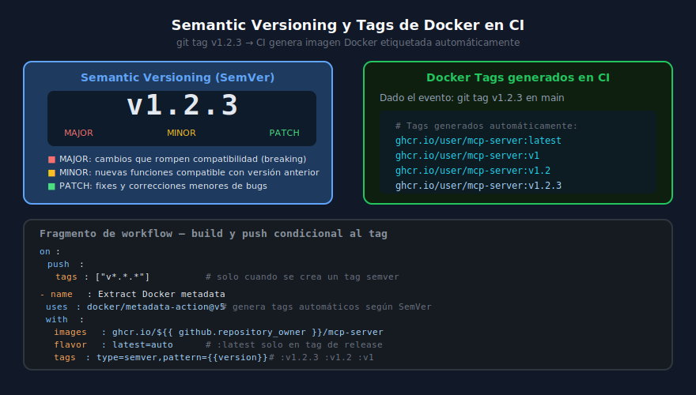

# Semantic Versioning y Tags de Docker en CI

## 🎯 Objetivos

- Entender el esquema SemVer (MAJOR.MINOR.PATCH) y cuándo usar cada nivel
- Crear tags de git para disparar pipelines de release
- Generar automáticamente múltiples tags Docker desde un tag SemVer
- Implementar un workflow de release completo: tag → build → push con versión

---



---

## 1. ¿Qué es Semantic Versioning?

**Semantic Versioning (SemVer)** es un convenio para nombrar versiones de software con tres números separados por puntos:

$$
\text{v MAJOR.MINOR.PATCH}
$$

| Componente | Cuándo incrementar | Ejemplo |
|------------|-------------------|---------|
| **MAJOR** | Cambios que rompen compatibilidad (breaking changes) | `v1.x.x → v2.0.0` |
| **MINOR** | Nuevas funcionalidades compatibles con la versión anterior | `v1.2.x → v1.3.0` |
| **PATCH** | Correcciones de bugs sin nuevas funcionalidades | `v1.2.3 → v1.2.4` |

### Reglas importantes

- Siempre empezar con `v0.1.0` para versiones alpha/beta iniciales
- El `v1.0.0` es el primer release estable con API pública definida
- No se retrocede en versiones: `v1.2.3` → siempre hacia adelante
- `v0.x.x` = inestable, se permiten breaking changes en MINOR

---

## 2. Flujo de Release con Git Tags

```bash
# 1. Asegurarse de estar en main y actualizado
git checkout main
git pull origin main

# 2. Ejecutar tests localmente
uv run pytest

# 3. Crear y empujar el tag
git tag -a v1.2.3 -m "Release v1.2.3: add book enrichment tool"
git push origin v1.2.3

# ↑ Este push dispara el workflow de release en GitHub Actions
```

GitHub Actions detecta el tag con:

```yaml
on:
  push:
    tags: ["v*.*.*"]     # Solo tags con formato SemVer
```

---

## 3. Estrategia de Tags Docker

Cuando se hace release de `v1.2.3`, se generan múltiples tags Docker automáticamente:

```
ghcr.io/user/mcp-server:latest   ← última versión estable
ghcr.io/user/mcp-server:v1       ← última 1.x.x
ghcr.io/user/mcp-server:v1.2     ← última 1.2.x
ghcr.io/user/mcp-server:v1.2.3   ← versión exacta (inmutable)
```

Esto es útil para que los usuarios puedan elegir su nivel de actualización:
- `v1.2.3` — exactamente esta versión, nunca cambia (para producción crítica)
- `v1.2` — últimas correcciones de bugs de 1.2.x (recomendado)
- `v1` — últimas funcionalidades de 1.x.x
- `latest` — siempre la más reciente

---

## 4. Workflow de Release Completo

```yaml
# .github/workflows/release.yml
name: Release — Build & Push Docker con SemVer

on:
  push:
    tags: ["v*.*.*"]

permissions:
  contents: read
  packages: write

jobs:
  test:
    name: Tests pre-release
    runs-on: ubuntu-latest
    steps:
      - uses: actions/checkout@v4
      - uses: actions/setup-python@v5
        with:
          python-version: "3.13"
      - run: pip install --no-cache-dir uv==0.6.6
      - run: uv sync --frozen --group test
      - run: uv run pytest
        env:
          DB_PATH: ":memory:"

  docker-release:
    name: Docker Release
    runs-on: ubuntu-latest
    needs: test
    steps:
      - uses: actions/checkout@v4

      - name: Set up Docker Buildx
        uses: docker/setup-buildx-action@v3

      - name: Login to GHCR
        uses: docker/login-action@v3
        with:
          registry: ghcr.io
          username: ${{ github.actor }}
          password: ${{ secrets.GITHUB_TOKEN }}

      # docker/metadata-action genera los tags SemVer automáticamente
      - name: Extract Docker metadata
        id: meta
        uses: docker/metadata-action@v5
        with:
          images: ghcr.io/${{ github.repository }}
          tags: |
            type=semver,pattern={{version}}      # v1.2.3
            type=semver,pattern={{major}}.{{minor}}  # v1.2
            type=semver,pattern={{major}}         # v1
            type=raw,value=latest                 # latest
          labels: |
            org.opencontainers.image.title=MCP Library Server
            org.opencontainers.image.description=MCP Server for book library management
            org.opencontainers.image.vendor=ergrato-dev

      - name: Build and push multi-arch image
        uses: docker/build-push-action@v6
        with:
          context: .
          file: Dockerfile.python
          push: true
          platforms: linux/amd64,linux/arm64    # Multi-arquitectura (ej. Apple Silicon)
          tags: ${{ steps.meta.outputs.tags }}
          labels: ${{ steps.meta.outputs.labels }}
          cache-from: type=gha
          cache-to: type=gha,mode=max

      # Publicar Release en GitHub con changelog automático
      - name: Create GitHub Release
        uses: actions/github-script@v7
        with:
          script: |
            await github.rest.repos.createRelease({
              owner: context.repo.owner,
              repo: context.repo.repo,
              tag_name: context.ref.replace('refs/tags/', ''),
              name: `Release ${context.ref.replace('refs/tags/', '')}`,
              draft: false,
              prerelease: false,
              generate_release_notes: true   // Genera changelog automático
            });
```

---

## 5. CHANGELOG y Release Notes

GitHub puede generar release notes automáticamente basándose en los commits desde la última release. Para personalizarlos, crear `.github/release.yml`:

```yaml
# .github/release.yml
changelog:
  exclude:
    labels: [ignore-for-release]
  categories:
    - title: "🚀 Nuevas funcionalidades"
      labels: [feat, enhancement]
    - title: "🐛 Bug fixes"
      labels: [fix, bug]
    - title: "🔒 Seguridad"
      labels: [security]
    - title: "📦 Dependencias"
      labels: [deps, dependencies]
    - title: "📚 Documentación"
      labels: [docs]
```

---

## 6. Verificar la imagen publicada

```bash
# Ver todas las tags disponibles de la imagen
docker pull ghcr.io/user/mcp-server:v1.2.3

# Inspeccionar labels y metadata de la imagen
docker inspect ghcr.io/user/mcp-server:v1.2.3 | jq '.[0].Config.Labels'

# Ejecutar la versión específica
docker run --rm -e DB_PATH=/data/db.sqlite \
  ghcr.io/user/mcp-server:v1.2.3
```

---

## 7. Pre-releases y Canary

Para versiones de prueba antes del release oficial:

```bash
# Pre-release alpha
git tag v2.0.0-alpha.1
git push origin v2.0.0-alpha.1

# Pre-release beta
git tag v2.0.0-beta.1
git push origin v2.0.0-beta.1

# Release candidate
git tag v2.0.0-rc.1
git push origin v2.0.0-rc.1
```

En el workflow, detectar pre-releases y marcarlos apropiadamente:

```yaml
tags: |
  type=semver,pattern={{version}}               # v2.0.0-alpha.1
  type=raw,value=canary,enable=${{ contains(github.ref, 'alpha') || contains(github.ref, 'beta') }}
  type=raw,value=latest,enable=${{ !contains(github.ref, '-') }}  # latest solo en release final
```

---

## 8. Errores Comunes

| Error | Causa | Solución |
|-------|-------|----------|
| Tag creado en rama equivocada | `git tag` sin hacer `git checkout main` primero | Siempre taggear desde main |
| Imagen sin tag `latest` | Tag con sufijo (`v1.0.0-rc.1`) activa `flavor: latest=auto` incorrectamente | Usar condición `enable` explícita en `type=raw` |
| Push falla: `unauthorized` | `GITHUB_TOKEN` no tiene permiso de packages | Agregar `permissions: packages: write` al job |
| Multi-arch falla: `exec format error` | Imagen amd64 ejecutada en arm64 sin emulación | Usar `docker/setup-qemu-action@v3` antes de buildx |

---

## ✅ Checklist de Verificación

- [ ] Workflow `release.yml` creado en `.github/workflows/`
- [ ] Trigger `on: push: tags: ["v*.*.*"]`
- [ ] `docker/metadata-action` genera tags semver automáticamente
- [ ] Tests se ejecutan antes del docker build
- [ ] Imagen publicada en GHCR con todos los tags correctos
- [ ] GitHub Release creada con notas automáticas
- [ ] `docker pull ghcr.io/user/mcp-server:v1.x.x` funciona

---

## 📚 Recursos Adicionales

- [SemVer Spec](https://semver.org/lang/es/)
- [docker/metadata-action docs](https://github.com/docker/metadata-action)
- [GitHub Releases](https://docs.github.com/en/repositories/releasing-projects-on-github)
- [GHCR — GitHub Container Registry](https://docs.github.com/en/packages/working-with-a-github-packages-registry/working-with-the-container-registry)

---

[← Anterior: CI pipeline](02-ci-pipeline-mcp.md) | [Siguiente: Documentación profesional →](04-documentacion-profesional-mcp.md)
