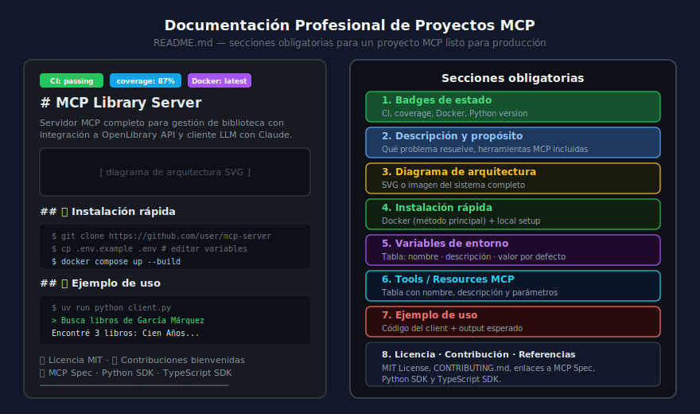

# Documentación Profesional de Proyectos MCP

## 🎯 Objetivos

- Estructurar un README profesional para un proyecto MCP
- Añadir badges dinámicos de CI, cobertura y Docker
- Documentar tools y resources MCP en tablas claras
- Crear una guía de instalación que funcione para cualquier usuario

---



---

## 1. ¿Por qué importa la documentación?

Un servidor MCP sin documentación es inútil para el 90% de los potenciales usuarios. La documentación es el primer contacto que tiene alguien con tu proyecto y determina:

- Si entienden qué hace el servidor en los primeros 30 segundos
- Si pueden levantarlo en su máquina sin pedir ayuda
- Si confían en que el proyecto está bien mantenido (badges)
- Si saben cómo integrarlo con Claude o su propio cliente MCP

Un README bien escrito es parte del producto.

---

## 2. Estructura del README

```markdown
# 📚 MCP Library Server

[](...)
[](...)
[](...)
[](...)
[](LICENSE)

> Servidor MCP para gestión de biblioteca con integración a OpenLibrary API.
> Construido con Python 3.13, FastMCP y SQLite.

## 🏗️ Arquitectura

[diagrama SVG]

## ✨ Tools disponibles

| Tool | Descripción | Parámetros |
|------|-------------|-----------|
| `search_books` | Busca libros por título o autor | `query: str`, `limit: int = 10` |
| `add_book` | Añade un nuevo libro | `title: str`, `author: str`, `year: int` |

## 🚀 Instalación rápida (Docker)

## 🔧 Variables de entorno

## 💬 Ejemplo de uso con client MCP

## 🧪 Desarrollo local

## 📄 Licencia
```

---

## 3. Badges

Los badges son indicadores visuales del estado del proyecto. Se añaden al inicio del README.

### Badge de GitHub Actions CI

```markdown
[](https://github.com/OWNER/REPO/actions/workflows/ci.yml)
```

### Badge de cobertura con shields.io

```markdown
[](https://github.com/OWNER/REPO)
```

> Para cobertura dinámica, integrar con [Codecov](https://codecov.io/) o [Coveralls](https://coveralls.io/).

### Badge de imagen Docker

```markdown
[](https://ghcr.io/OWNER/REPO)
```

### Badge de Python version

```markdown
[](https://python.org)
```

### Badge de licencia

```markdown
[](https://opensource.org/licenses/MIT)
```

---

## 4. Sección de Instalación

La instalación debe ser tan simple como posible. El método principal siempre es Docker.

```markdown
## 🚀 Instalación rápida

### Opción 1: Docker (recomendado)

\```bash
# 1. Clonar el repositorio
git clone https://github.com/user/mcp-server.git
cd mcp-server

# 2. Configurar variables de entorno
cp .env.example .env
# Editar .env con tus valores (API keys, etc.)

# 3. Levantar el servidor
docker compose up --build

# El servidor MCP estará disponible en http://localhost:8000
\```

### Opción 2: Desarrollo local (sin Docker)

\```bash
pip install uv==0.6.6
uv sync --frozen
uv run python src/server.py
\```
```

---

## 5. Tabla de Variables de Entorno

```markdown
## 🔧 Variables de entorno

| Variable | Descripción | Requerida | Valor por defecto |
|----------|-------------|-----------|-------------------|
| `DB_PATH` | Ruta a la base de datos SQLite | No | `./library.db` |
| `ANTHROPIC_API_KEY` | API key de Anthropic para el cliente LLM | Sí | — |
| `OPENLIBRARY_URL` | URL base de OpenLibrary API | No | `https://openlibrary.org` |
| `MAX_SEARCH_RESULTS` | Máximo de resultados por búsqueda | No | `20` |
| `LOG_LEVEL` | Nivel de logging | No | `INFO` |

> ⚠️ Nunca subas el archivo `.env` al repositorio. Está en `.gitignore`.
```

---

## 6. Tabla de Tools MCP

Documentar todos los tools disponibles en el servidor:

```markdown
## ✨ Tools disponibles

| Tool | Descripción | Parámetros | Retorna |
|------|-------------|-----------|---------|
| `search_books` | Busca libros por título o autor | `query: str`, `limit: int = 10` | `list[Book]` |
| `get_book` | Obtiene un libro por ID | `book_id: int` | `Book \| null` |
| `add_book` | Añade un nuevo libro a la biblioteca | `title: str`, `author: str`, `year: int` | `Book` |
| `update_book` | Actualiza campos de un libro | `book_id: int`, `title?: str`, `author?: str` | `Book` |
| `delete_book` | Elimina un libro | `book_id: int` | `bool` |
| `search_openlibrary` | Busca en OpenLibrary.org | `title: str` | `list[ExternalBook]` |
| `enrich_book` | Enriquece un libro con datos de OpenLibrary | `book_id: int` | `Book` |
```

---

## 7. Ejemplo de Uso con Cliente MCP

```markdown
## 💬 Ejemplo de uso

\```python
# Ejecutar el cliente MCP con agente LLM
uv run python client.py
\```

**Conversación de ejemplo:**

```
> ¿Qué libros de Borges tenemos en la biblioteca?

Claude está usando el tool search_books...
  → query: "Borges"

Encontré 3 libros de Jorge Luis Borges:
1. Ficciones (1944) — ID: 12
2. El Aleph (1949) — ID: 7
3. Laberintos (1962) — ID: 23

¿Quieres que busque más información sobre alguno?
```

```
> Enriquece el libro ID 12 con datos de OpenLibrary

Claude está usando el tool search_openlibrary...
  → title: "Ficciones Borges"
Claude está usando el tool enrich_book...
  → book_id: 12

Libro actualizado: Ficciones (1944)
- Autor: Jorge Luis Borges
- ISBN: 9780802130303
- Páginas: 174
- Descripción: Colección de cuentos que incluye "El jardín de senderos...
```
```

---

## 8. Sección de Desarrollo

```markdown
## 🧪 Desarrollo

### Ejecutar tests

\```bash
uv run pytest --cov=src --cov-report=term-missing
\```

### Lint y format

\```bash
uv run ruff check --fix .
uv run ruff format .
uv run mypy src/
\```

### Estructura del proyecto

\```
src/
├── server.py          # Punto de entrada MCP
├── validators.py      # Schemas Pydantic
├── config.py          # Variables de entorno
└── utils/db.py        # Acceso a base de datos
tests/
├── conftest.py        # Fixtures compartidos
└── test_tools.py      # Tests de tools MCP
\```
```

---

## 9. Archivo CONTRIBUTING.md

```markdown
# Contribuir

1. Fork del repositorio
2. Crear una rama: `git checkout -b feat/nueva-funcionalidad`
3. Implementar cambios con tests
4. Verificar que CI pasa: `uv run pytest && uv run ruff check .`
5. Abrir un Pull Request con descripción clara

## Convenciones de commits

Usar Conventional Commits:
- `feat:` nuevas funcionalidades
- `fix:` correcciones de bugs
- `docs:` cambios en documentación
- `chore:` mantenimiento general
```

---

## 10. Errores Comunes en Documentación

| Error | Impacto | Solución |
|-------|---------|----------|
| README en inglés + code en español | Confusión de idiomas | Documentación en español, código en inglés |
| No incluir `.env.example` | Usuario no sabe qué variables configurar | Siempre incluir `.env.example` en el repo |
| Instrucciones solo para un OS | Usuario de Windows o macOS no puede seguirlas | Docker resuelve la portabilidad |
| No documentar parámetros de tools | El LLM genera llamadas incorrectas | Tabla completa con tipos y valores por defecto |
| Badges rotos | Da imagen de proyecto abandonado | Verificar URLs de badges antes del release |

---

## ✅ Checklist de Verificación

- [ ] Badges de CI, coverage, Docker y licencia en el README
- [ ] Descripción clara en las primeras 3 líneas
- [ ] Diagrama de arquitectura incluido
- [ ] Tabla de tools MCP con parámetros y retorno
- [ ] Tabla de variables de entorno
- [ ] Instrucciones de instalación con Docker
- [ ] Ejemplo de conversación con el cliente LLM
- [ ] Sección de desarrollo (tests + lint)
- [ ] `CONTRIBUTING.md` o sección de contribución
- [ ] `.env.example` en el repositorio (nunca `.env`)
- [ ] `LICENSE` presente

---

## 📚 Recursos Adicionales

- [shields.io — Badges](https://shields.io/)
- [Conventional Commits](https://www.conventionalcommits.org/)
- [How to Write a Good README](https://www.makeareadme.com/)
- [GitHub Flavored Markdown](https://docs.github.com/en/get-started/writing-on-github)

---

[← Anterior: SemVer](03-semantic-versioning-docker-tags.md) | [Siguiente: Arquitectura en producción →](05-arquitectura-sistemas-mcp-produccion.md)
