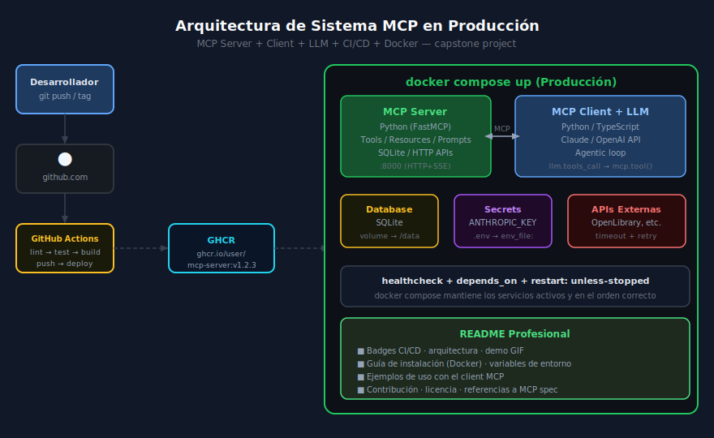

# Patrones de Arquitectura para Sistemas MCP en Producción

## 🎯 Objetivos

- Conocer los patrones arquitectónicos más usados en sistemas MCP reales
- Entender cómo orquestar múltiples servidores MCP con un cliente
- Implementar el agentic loop completo con herramientas reales
- Diseñar un sistema MCP capstone con CI/CD y Docker

---



---

## 1. Del Server simple al Sistema Completo

Durante el bootcamp, la evolución fue:

| Semana | Patrón | Componentes |
|--------|--------|-------------|
| 04 | Server básico | 1 tool, stdio |
| 06 | Server intermedio | tools + resources + prompts |
| 07 | Server integrado | DB + APIs externas |
| 08–09 | Client + LLM | MCP Client conecta al server |
| 11 | Producción básica | Testing + Seguridad + Docker |
| **12** | **Sistema completo** | **Server + Client + LLM + CI/CD + Docker** |

---

## 2. Patrón: Servidor MCP con HTTP/SSE

Para producción, el transport recomendado es **HTTP con SSE** (Server-Sent Events) en vez de stdio. Permite múltiples clientes concurrentes y es accesible desde la red.

```python
# src/server.py — HTTP+SSE transport
import asyncio
from mcp.server.fastmcp import FastMCP
from mcp.server.sse import SseServerTransport
from starlette.applications import Starlette
from starlette.routing import Mount, Route

mcp = FastMCP("library-server")

# ... tools, resources, prompts ...

# Crear app ASGI con SSE
sse = SseServerTransport("/messages/")

async def handle_sse(request):
    async with sse.connect_sse(
        request.scope, request.receive, request._send
    ) as streams:
        await mcp._mcp_server.run(
            streams[0], streams[1],
            mcp._mcp_server.create_initialization_options()
        )

app = Starlette(
    routes=[
        Route("/sse", endpoint=handle_sse),
        Mount("/messages/", app=sse.handle_post_message),
    ]
)

if __name__ == "__main__":
    import uvicorn
    uvicorn.run(app, host="0.0.0.0", port=8000)
```

Con esto, el servidor MCP es accesible en `http://localhost:8000/sse`.

---

## 3. Patrón: Cliente MCP con Agentic Loop

El **agentic loop** es el ciclo donde el LLM decide qué tools usar, las ejecuta y sintetiza los resultados. Se repite hasta que el LLM no necesita más información.

```python
# client.py — Agentic loop completo con Claude
import asyncio
import json
import anthropic
from mcp import ClientSession
from mcp.client.sse import sse_client

async def run_agent(user_message: str) -> None:
    """Agentic loop: el LLM decide qué tools usar y cuándo parar."""
    anthropic_client = anthropic.Anthropic()  # ANTHROPIC_API_KEY desde env

    async with sse_client("http://localhost:8000/sse") as (read, write):
        async with ClientSession(read, write) as session:
            await session.initialize()

            # Obtener tools disponibles del server MCP
            tools_result = await session.list_tools()
            tools = [
                {
                    "name": t.name,
                    "description": t.description,
                    "input_schema": t.inputSchema,
                }
                for t in tools_result.tools
            ]

            messages = [{"role": "user", "content": user_message}]

            # Loop agentico
            while True:
                response = anthropic_client.messages.create(
                    model="claude-opus-4-5",
                    max_tokens=4096,
                    tools=tools,
                    messages=messages,
                )

                # Si el LLM termina sin usar tools, mostrar respuesta final
                if response.stop_reason == "end_turn":
                    for block in response.content:
                        if hasattr(block, "text"):
                            print(block.text)
                    break

                # Si el LLM quiere usar tools, ejecutarlas
                if response.stop_reason == "tool_use":
                    messages.append({"role": "assistant", "content": response.content})

                    tool_results = []
                    for block in response.content:
                        if block.type == "tool_use":
                            print(f"  → {block.name}({json.dumps(block.input)})")
                            result = await session.call_tool(block.name, block.input)
                            tool_results.append({
                                "type": "tool_result",
                                "tool_use_id": block.id,
                                "content": result.content[0].text if result.content else "",
                            })

                    messages.append({"role": "user", "content": tool_results})


if __name__ == "__main__":
    import sys
    prompt = " ".join(sys.argv[1:]) if len(sys.argv) > 1 else "¿Qué libros hay en la biblioteca?"
    asyncio.run(run_agent(prompt))
```

---

## 4. Patrón: Multi-Server con Orquestación

En sistemas avanzados, un único cliente puede conectarse a múltiples servidores MCP especializados:

```python
# client_multi.py — Conectar a múltiples MCP Servers
from mcp import ClientSession
from mcp.client.sse import sse_client
from contextlib import asynccontextmanager

SERVERS = {
    "library": "http://library-server:8000/sse",
    "weather": "http://weather-server:8001/sse",
    "calculator": "http://calc-server:8002/sse",
}

async def get_all_tools(sessions: dict) -> list:
    """Recopila tools de todos los servers MCP activos."""
    all_tools = []
    for server_name, session in sessions.items():
        result = await session.list_tools()
        for tool in result.tools:
            # Prefixar con nombre del server para evitar colisiones
            all_tools.append({
                "name": f"{server_name}__{tool.name}",
                "description": f"[{server_name}] {tool.description}",
                "input_schema": tool.inputSchema,
                "_server": server_name,
            })
    return all_tools
```

---

## 5. Docker Compose para Sistema Completo

```yaml
# docker-compose.yml — Sistema MCP completo en producción
services:
  mcp-server:
    build:
      context: .
      dockerfile: Dockerfile.python
    image: ghcr.io/user/mcp-server:latest
    ports:
      - "8000:8000"
    volumes:
      - library-data:/data
    environment:
      - DB_PATH=/data/library.db
      - OPENLIBRARY_URL=https://openlibrary.org
    env_file: .env                    # ANTHROPIC_API_KEY y otros secretos
    healthcheck:
      test: ["CMD", "curl", "-f", "http://localhost:8000/sse"]
      interval: 30s
      timeout: 10s
      retries: 3
      start_period: 10s
    restart: unless-stopped

  mcp-client:
    build:
      context: .
      dockerfile: Dockerfile.client
    image: ghcr.io/user/mcp-client:latest
    depends_on:
      mcp-server:
        condition: service_healthy    # Espera a que el server esté listo
    environment:
      - MCP_SERVER_URL=http://mcp-server:8000/sse
    env_file: .env
    stdin_open: true                  # Para input interactivo
    tty: true
    restart: unless-stopped

volumes:
  library-data:                       # Persistencia de la base de datos
    driver: local
```

---

## 6. Patrón: Healthcheck y Readiness

En producción, el sistema necesita saber si el servidor está listo para recibir peticiones.

```python
# Añadir endpoint de healthcheck al server HTTP
from starlette.responses import JSONResponse

async def healthcheck(request):
    """Endpoint para healthcheck del orchestrator."""
    return JSONResponse({"status": "ok", "service": "mcp-library-server"})

app = Starlette(
    routes=[
        Route("/health", endpoint=healthcheck),
        Route("/sse", endpoint=handle_sse),
        Mount("/messages/", app=sse.handle_post_message),
    ]
)
```

```yaml
# En docker-compose.yml
healthcheck:
  test: ["CMD", "curl", "-f", "http://localhost:8000/health"]
  interval: 30s
  timeout: 10s
  retries: 3
  start_period: 15s
```

---

## 7. Variables de Configuración en Producción

```python
# src/config.py — Configuración centralizada con validación
import os
from pydantic import BaseSettings, validator

class Settings(BaseSettings):
    """Configuración del servidor leída de variables de entorno."""

    db_path: str = "./library.db"
    openlibrary_url: str = "https://openlibrary.org"
    max_search_results: int = 20
    log_level: str = "INFO"
    host: str = "0.0.0.0"
    port: int = 8000

    class Config:
        env_file = ".env"
        env_file_encoding = "utf-8"

settings = Settings()
```

---

## 8. Logging Estructurado para Producción

```python
# src/server.py — Logging estructurado con JSON
import logging
import json

class JSONFormatter(logging.Formatter):
    """Formateador de logs en JSON para facilitar análisis."""

    def format(self, record: logging.LogRecord) -> str:
        log_data = {
            "timestamp": self.formatTime(record),
            "level": record.levelname,
            "message": record.getMessage(),
            "logger": record.name,
        }
        if record.exc_info:
            log_data["exception"] = self.formatException(record.exc_info)
        return json.dumps(log_data)

# Configurar logger
logger = logging.getLogger("mcp-server")
handler = logging.StreamHandler()
handler.setFormatter(JSONFormatter())
logger.addHandler(handler)
logger.setLevel(logging.INFO)

# Uso en tools
@mcp.tool()
async def search_books(query: str) -> str:
    logger.info("tool_call", extra={"tool": "search_books", "query": query})
    # ...
```

---

## 9. Errores Comunes en Arquitectura

| Error | Consecuencia | Solución |
|-------|-------------|----------|
| Usar stdio en producción | Solo 1 cliente a la vez | Cambiar a HTTP+SSE transport |
| DB sin volumen persistente | Datos perdidos al reiniciar el contenedor | Siempre usar `volumes:` en docker-compose |
| Sin healthcheck | Client conecta antes de que server esté listo | Agregar `depends_on: condition: service_healthy` |
| Secretos en variables de entorno del Dockerfile | Keys visibles en `docker inspect` | Usar `env_file:` o Docker secrets |
| Sin rate limiting en tools externos | DoS a APIs externas + costos inesperados | `asyncio.timeout()` + rate limiter |

---

## ✅ Checklist del Sistema Completo

- [ ] MCP Server con HTTP+SSE transport
- [ ] MCP Client con agentic loop (while → tool_use → end_turn)
- [ ] LLM integrado (Claude o compatible)
- [ ] `docker-compose.yml` con server + client + volumen persistente
- [ ] Healthcheck en el server + `depends_on` en el client
- [ ] Variables de entorno en `.env` (no hardcodeadas)
- [ ] `.env.example` en el repo con nombres y descripciones
- [ ] CI/CD con GitHub Actions: lint → test → build → push
- [ ] README profesional con badges, tabla de tools y ejemplo de uso
- [ ] Tests con ≥75% de cobertura

---

## 📚 Recursos Adicionales

- [MCP HTTP+SSE Transport](https://modelcontextprotocol.io/docs/concepts/transports)
- [Anthropic Tool Use Guide](https://docs.anthropic.com/en/docs/build-with-claude/tool-use)
- [Docker Compose Healthcheck](https://docs.docker.com/compose/compose-file/05-services/#healthcheck)
- [Pydantic Settings Management](https://docs.pydantic.dev/latest/concepts/pydantic_settings/)

---

[← Anterior: Documentación profesional](04-documentacion-profesional-mcp.md) | [→ Volver al README](../README.md)
